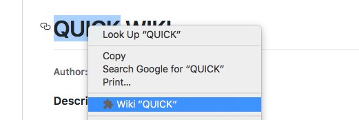
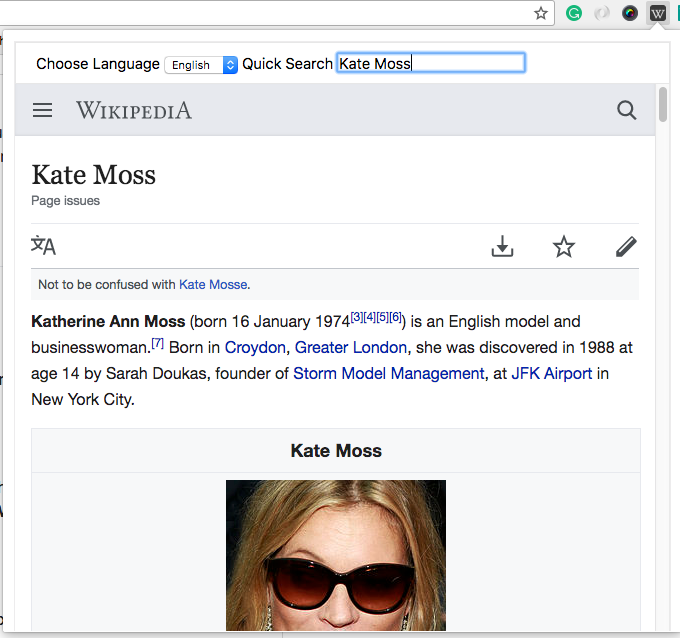

# QUICK WIKI

###### Author: Jin Dong, Yunting Tan

#### Description:
This is a Chrome Plugin that allow quick Wikipedia keyword search in webpages without turn to Wikipedia homepage and search. 

#### How to install:

1. First git clone this repo to your computer
```
git clone https://github.com/zoe3351/chromeExtension.git
```

2. Then open <chrome://extensions/> in your Chrome browser, check the box of **Developer mode**, then click on **Load unpacked extensions**, and browse to the folder of this extension. You will see a plugin called **Quick WIKI**, remember make sure the Box **Enabled** is checked.

#### How to use:

1. You can select a word or sentence and click the right button, select "Wiki..." in the popup menu, the browser will open and jump to the wiki webpage of your selected words.

    

2. You can also click on the black `W` con on the upright side of navigation bar, and see a tab popup with Wikipedia mobile homepage. You can choose language that you want to search on, also put in contents you want to search, then press **Quick Search** button, it will turn to corresponding page of wikipedia in your selected language.

      


